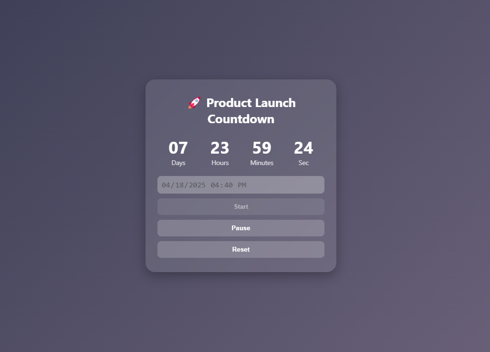

# ProiectareCadrelorAplicatie

# ⏳ Countdown Timer Web Component

A modern, interactive, and reusable Web Component for setting countdowns to any date and time, with a beautiful glassmorphic UI and full control via HTML.



---

## 🚀 Introduction

The **CountdownTimer Web Component** is a lightweight, encapsulated countdown widget built using the Web Components API. It allows users to interactively set a countdown to any future date and time with an intuitive interface and customizable title.

This component is ideal for use in events, product launches, exams, deadlines, or any moment you want to count down to — right in your HTML!

---

## ✨ Key Features

- 📝 **Custom Title** — Set your own heading using the `title` attribute.
- 🕒 **Live Countdown** — Updates every second.
- 🧠 **Interactive UI** — Pick the date and time using an input field.
- ⏯️ **Start, Pause/Resume, Reset** controls.
- 💎 **Modern Design** — Glassmorphism, responsive layout, and subtle animations.
- 🔄 **Reusable & Isolated** — Shadow DOM ensures style encapsulation and no CSS conflicts.

---

## 🛠 Technologies Used

| Language     | Description                                 |
|--------------|---------------------------------------------|
| **HTML**     | Base structure and custom element usage     |
| **CSS**      | Styling with glassmorphism & responsiveness |
| **JavaScript** | Web Component logic and event handling     |

---

## 🧱 Usage

### ✅ 1. Include the script in your HTML `<head>` or before `</body>`

```html
<script src="countdown-timer.js" defer></script>
```

### ✅ 2. Edit the title of the timer as you like 

```html
<countdown-timer title="🎓 Exam Countdown"></countdown-timer>
```

## Example code for index.html

```html
<!DOCTYPE html>
<html lang="en">
<head>
  <meta charset="UTF-8">
  <title>Countdown Timer</title>
  <script src="countdown-timer.js" defer></script>
  <style>
    body {
      margin: 0;
      height: 100vh;
      background: linear-gradient(135deg, #32374e 0%, #756981 100%);
      display: flex;
      align-items: center;
      justify-content: center;
      font-family: 'Segoe UI', sans-serif;
    }
  </style>
</head>
<body>
  <countdown-timer title="🚀 Product Launch Countdown"></countdown-timer>
</body>
</html>

```

